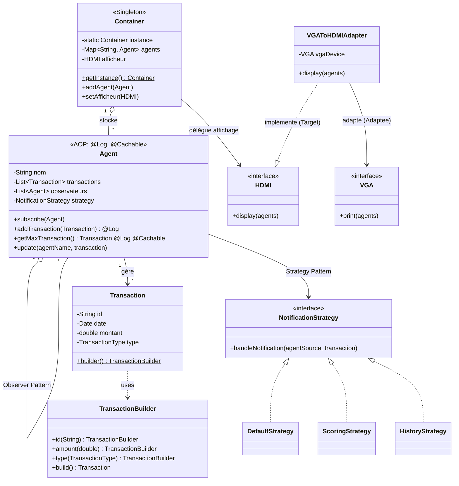

# Rapport d'Examen : Design Patterns & AOP

**Nom/Prénom :** [ VOTRE NOM ]
**Date :** 29/12/2025

---

## 1. Diagramme de classe simplifié

Voici la structure statique détaillée du modèle montrant tous les patterns et l'usage de l'AOP.



---

## 2. Implémentation et test de la classe Transaction

La classe `Transaction` utilise le **Builder Pattern** pour faciliter sa construction et garantir son immutabilité.

**Code source (Extrait) :**
```java
// Transaction.java (Extrait)
public class Transaction {
    // Attributs privés
    private Transaction(String id, LocalDateTime date, double montant, TransactionType type) { ... }

    public static class Builder {
        public Builder setId(String id) { ... }
        public Builder setMontant(double montant) { ... }
        public Transaction build() { return new Transaction(...); }
    }
}
```

**Test unitaire :**
La création via le builder fonctionne correctement.
```java
Transaction t = Transaction.builder()
        .setId("TXN1")
        .setType(TransactionType.VENTE)
        .setMontant(1000)
        .build();
```

**Preuve d'exécution :**
> [INSÉRER ICI SCREENSHOT TEST TRANSACTION OU CONSOLE]

---

## 3. Implémentation et test de la classe Agent

La classe `Agent` implémente le **Observer Pattern**. Un agent peut souscrire aux notifications d'un autre agent.

**Code source (Extrait) :**
```java
// Agent.java (Extrait)
public class Agent {
    private List<Agent> observateurs = new ArrayList<>();

    public void subscribe(Agent agent) {
        observateurs.add(agent);
    }

    public void addTransaction(Transaction t) {
        transactions.add(t);
        notifyObservers(t); // Notification automatique
    }
}
```

**Test unitaire :**
Lorsqu'un agent ajoute une transaction, ses abonnés sont notifiés automatiquement.

**Preuve d'exécution :**
> [INSÉRER ICI SCREENSHOT TEST AGENT OU CONSOLE]

---

## 4. Implémentation et test de la classe Container

La classe `Container` utilise le **Singleton Pattern** pour assurer une instance unique.

**Code source (Extrait) :**
```java
// Container.java (Extrait)
public class Container {
    private static Container instance;
    
    private Container() { ... } // Constructeur privé

    public static synchronized Container getInstance() {
        if (instance == null) {
            instance = new Container();
        }
        return instance;
    }
}
```

**Test unitaire :**
`Container.getInstance() == Container.getInstance()` retourne `true`.

**Preuve d'exécution :**
> [INSÉRER ICI SCREENSHOT TEST CONTAINER]

---

## 5. Patterns supplémentaires

Pour enrichir l'application, nous avons intégré deux patterns majeurs supplémentaires :

### A. Strategy Pattern (Gestion des notifications)
Permet de changer dynamiquement la façon dont un agent traite une notification (ex: calcul de solde vs historique).

```java
public interface NotificationStrategy {
    void handleNotification(String agentSource, Transaction transaction);
}
// Implémenté par ScoringStrategy et HistoryStrategy
```

### B. Adapter Pattern (Affichage)
Permet d'utiliser un écran VGA (legacy) sur une sortie HDMI via un adaptateur.

```java
public class VGAToHDMIAdapter implements HDMI {
    private VGA vga;
    public VGAToHDMIAdapter(VGA vga) { this.vga = vga; }
    
    @Override
    public void display(HashMap<String, Agent> agents) {
        // Adaptation des données et appel à vga.show()
        vga.show(convertToString(agents));
    }
}
```

---

## 6. Implémentation des Aspects Techniques (AOP)

Nous avons utilisé AspectJ pour gérer les préoccupations transversales.

### a. Aspect de Journalisation (@Log)
Log la durée d'exécution des méthodes.

```java
@Around("@annotation(org.sid.aspects.annotations.Log)")
public Object logExecutionTime(ProceedingJoinPoint joinPoint) throws Throwable {
    long start = System.currentTimeMillis();
    Object result = joinPoint.proceed();
    long duration = System.currentTimeMillis() - start;
    System.out.println("[LOG] " + joinPoint.getSignature().getName() + " : " + duration + "ms");
    return result;
}
```

### b. Aspect de Cache (@Cachable)
Appliqué sur `getMaxTransaction()`. Met en cache le résultat et l'invalide si une nouvelle transaction est ajoutée.

```java
@Around("@annotation(org.sid.aspects.annotations.Cachable)")
public Object cacheResult(ProceedingJoinPoint joinPoint) { ... }

@Around("execution(* org.sid.observer.Agent.addTransaction(..))")
public Object invalidateCache(ProceedingJoinPoint joinPoint) { 
    // ... Logic d'invalidation
}
```

### c. Aspect de Sécurité (@SecuredBy)
Vérifie les rôles avant l'exécution.

```java
@Around("@annotation(org.sid.aspects.annotations.SecuredBy)")
public Object checkSecurity(ProceedingJoinPoint joinPoint) {
    // Vérification du rôle utilisateur dans SecurityContext
    if (!user.hasRole(requiredRole)) throw new RuntimeException("Accès refusé");
    return joinPoint.proceed();
}
```

**Preuve globale d'exécution (Console) :**
> [INSÉRER ICI SCREENSHOT DE LA CONSOLE AVEC LES LOGS [LOG], [CACHE], ETC.]
